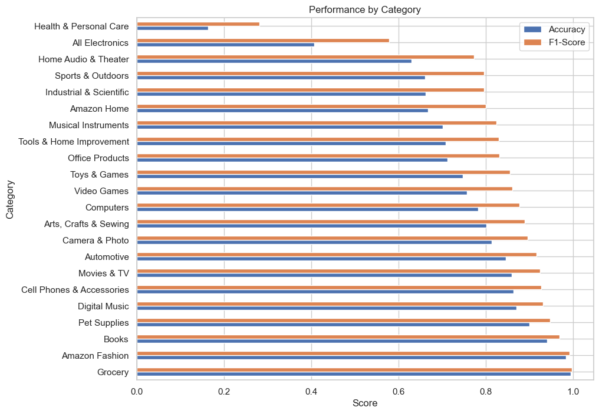

# Product Classification API

This project is a Machine Learning-based API for classifying products into their main categories based on their features, using a simplified dataset derived from Amazon product data. Project carried out by Javier López Palacios for some company Code Challenge.

---

## **Table of Contents**
1. [Setup Instructions](#setup-instructions)
2. [Directory Structure](#directory-structure)
3. [Exploratory Data Analysis (EDA)](#exploratory-data-analysis-eda)
4. [Data Preprocessing](#data-preprocessing)
5. [Model Selection and Justification](#model-selection-and-justification)
6. [Model Evaluation](#model-evaluation)
6. [How to Run Locally](#how-to-run-locally)
7. [Using Docker](#using-docker)
8. [API Endpoints](#api-endpoints)
9. [Sample Request](#sample-request)
10. [Task Questions](#task-questions)

---

## **Setup Instructions**

### 1. Clone the repository:
```bash
git clone https://github.com/javilopez27/product-classification-api.git
cd javier_lopez
```

### 2. Set up a virtual environment and install dependencies:
```bash
python -m venv venv
venv\Scripts\activate       # On Windows
pip install -r requirements.txt
```

### 3. Download required files
To ensure that the project works without retraining the model, use the provided script to download the necessary large files from Google Drive as Github does not allow uploading files larger than 100 MB:
```bash
python scripts/download_files.py
```
This will download:
- `amz_products_small.jsonl.gz` to data/raw/
- `classifier_model.pkl` to models/
- `X_train.pkl` to data/processed/

### 4. File Requirements
Make sure that the following files exist and are in their appropriate locations, if you do not want to retrain the model:
- `models/tfidf_vectorizer.pkl` (TF-IDF vectorizer)
- `models/classifier_model.pkl` (Trained RandomForestClassifier)
- `data/raw/amz_products_small.jsonl.gz` (Dataset)
- `data/processed/X_train.pkl` (Processed training data)

### 5. Run the API:
Start the API server with Uvicorn:
```bash
uvicorn src.api:app --reload
```

---

## **Directory Structure**
```plaintext
project/
│
├── data/                    # Data directory
│   ├── raw/                 # Raw JSONL data
│   ├── processed/           # Preprocessed data files
│
├── metadata/                # Metadata directory for scalers and additional model data
│   ├── price_scaler.pkl     # MinMaxScaler for price normalization
│   ├── price_metadata.json  # JSON with outlier bounds (lower_bound, upper_bound)
│
├── models/                  # Saved models
│   ├── tfidf_vectorizer.pkl # Vectorizer for text features
│   ├── classifier_model.pkl # Trained classification model
│
├── notebooks/               # Jupyter notebooks
│   ├── eda.ipynb            # Exploratory Data Analysis
│   ├── eval.ipynb           # Model evaluation
│
├── src/                     # Source code
│   ├── preprocess.py        # Data preprocessing script
│   ├── train.py             # Model training script
│   ├── api.py               # FastAPI server for inference
│
├── scripts/                 # Utility scripts
│   ├── download_files.py    # Script to download large files from Google Drive
│
├── .gitattributes           # Git LFS configuration for large files
├── .gitignore               # Ignored files
├── requirements.txt         # Python dependencies
├── Dockerfile               # Docker configuration
├── README_task.md                # Project documentation
└── README.md       # Solution documentation
```

---

## **Exploratory Data Analysis (EDA)**

### **1. Distribution of `main_cat`**
The dataset contains 22 categories. Here's the distribution of products across these categories:


This imbalance was considered during preprocessing and evaluation. Categories with fewer examples may have lower predictive performance.

### **2. Handling `price` Outliers**
The `price` column was heavily skewed, with significant outliers:


To address this:
- Outliers were clipped using the interquartile range (IQR).
- Prices were log-transformed and normalized to fall between 0 and 1:
    ```json
    {
        "lower_bound": -22.485,
        "upper_bound": 37.475
    }
    ```

### **3. `also_buy` and `also_view` Relationships**
The columns `also_buy` and `also_view` represent product connections. A graph-based analysis revealed that most products have very few connections:


These counts were used as features (`also_buy_count` and `also_view_count`) to capture product connectivity.

### **4. Text Vectorization**
Text fields (`description`, `title`, and `feature`) were concatenated and vectorized using TF-IDF. The following word cloud illustrates the most common terms:


---

## **Data Preprocessing**

The preprocessing pipeline performs several key operations to prepare the data for modeling. The absence of missing values in this dataset was, without doubt, an ideal situation, so I simplified the process of handling missing values. Below is a summary of the steps included in the `data_preprocessing.py` script:

### **1. Text Preprocessing**
- The `description`, `title`, and `feature` fields are concatenated into a single `text` column.
- Text is vectorized using TF-IDF with a maximum of 2000 features.

### **2. Price Normalization**
- Prices are cleaned by removing symbols such as `$` and commas.
- Outliers are handled using IQR bounds, and values are log-transformed.
- The resulting `price_cleaned` is scaled to a range of [0, 1] using MinMaxScaler.
- The scaler and metadata are saved to the `metadata/` directory for use during inference.

### **3. Feature Engineering**
- **Brand Encoding**: Brands are frequency-encoded based on their occurrence in the dataset.
- **Image Availability**: A binary feature `has_image` is added to indicate whether an image is available.
- **Product Relationships**: The counts of `also_buy` and `also_view` relationships are extracted as features.

### **4. Output**
- The processed data is split into training and testing sets.
- Sparse matrices for text features and dense matrices for engineered features are combined and saved to the `data/processed/` directory.

---

## **Model Evaluation**

### **Evaluation Overview**
The model evaluation was performed on the test dataset using standard metrics and error analysis to assess its predictive performance. All this evaluation can be found visually in the `eval.ipynb` notebook inside the `notebooks` folder.

### **1. Classification Report**
Key metrics:
- **Precision**: Measures the accuracy of positive predictions for each category.
- **Recall**: Measures how well the model retrieves all the true positive instances for each category.
- **F1-Score**: The harmonic mean of precision and recall, providing a balanced metric.
- **Accuracy**: The overall percentage of correct predictions across all categories.

The classification report for the model is as follows:
- **Accuracy**: 78%
- **Macro Average F1-Score**: 75%
- **Weighted Average F1-Score**: 77%

### **2. Error Analysis**
The model's errors were analyzed to identify patterns in misclassification:
- **Percentage of Incorrect Predictions**: 22.28% of the predictions were incorrect.
- **Error Patterns**:
  - Categories with fewer training samples, such as "Health & Personal Care," were more likely to be misclassified, as evidenced by its low recall (16%).
  - Categories with overlapping features, such as "Sports & Outdoors" and "Tools & Home Improvement," showed consistent confusion.
  - Ambiguity in product descriptions contributed significantly to errors, especially for similar categories like "Industrial & Scientific" and "Home Audio & Theater."

### **3. Sample Errors**
The table below highlights examples of misclassified instances from the test set:

| True Label                   | Predicted Label           | Features                                           |
|------------------------------|---------------------------|----------------------------------------------------|
| Automotive                   | Electronics               | Product with ambiguous descriptions and features. |
| Health & Personal Care       | Office Products           | Lacked distinct words in the description.         |
| Sports & Outdoors            | Tools & Home Improvement | Similar product features and overlapping terms.   |

### **4. Performance by Category**


From the "Performance by Category" chart:
- **High-performing categories**:
  - "Grocery" (F1-Score: 1.00) and "Amazon Fashion" (F1-Score: 0.96) showed exceptional performance.
  - "Books" and "Pet Supplies" also demonstrated strong recall and precision.
- **Low-performing categories**:
  - "Health & Personal Care" (F1-Score: 0.27) struggled significantly, primarily due to its limited support in the dataset.
  - "All Electronics" and "Home Audio & Theater" exhibited moderate performance but were affected by high inter-category confusion.

### **5. Confusion Matrix Insights**


The confusion matrix reveals patterns in misclassification:
- **Frequent Confusions**:
  - "All Electronics" was often misclassified as "Home Audio & Theater" or "Industrial & Scientific."
  - "Health & Personal Care" showed significant overlap with "Office Products" and "Grocery."
- **Misclassification Sources**:
  - Sparse categories with fewer samples were more susceptible to being misclassified into high-support categories.

### **6. Insights and Recommendations**
- **Model Strengths**:
  - Handles well-represented categories like "Grocery" and "Amazon Fashion" effectively.
  - Demonstrates robust performance across balanced datasets.
- **Areas for Improvement**:
  - **Dataset Augmentation**:
    - Increase the training samples for underrepresented categories like "Health & Personal Care" and "All Electronics."
  - **Advanced Feature Extraction**:
    - Experiment with deep learning models (e.g., transformers) to enhance text feature extraction and capture semantic nuances.
  - **Error-specific Strategies**:
    - Introduce category-specific embeddings or hierarchical classification for overlapping categories.

### **7. Visualization Reference**
- **Performance by Category**: Highlights the variation in accuracy and F1-score across categories.
- **Confusion Matrix**: Provides insights into inter-category misclassification patterns.


---
## **Model Selection and Justification**

### **Model Used**
The selected model for this project is the **Random Forest Classifier**. This model was chosen due to its:

- **Versatility**: Handles both numerical and categorical data effectively.
- **Robustness**: Resilient to overfitting, especially with parameter tuning.
- **Feature Importance**: Provides insights into the contribution of each feature.

### **Strengths**
- **Non-linearity**: Captures complex relationships in the data.
- **Interpretability**: Outputs feature importance, aiding explainability.
- **Scalability**: Can handle large datasets efficiently with parallel processing.

### **Limitations**
- **Memory Usage**: Consumes more memory compared to linear models.
    - **Solutions**:
        - **Use Sparse Matrix Directly**: Avoid converting the sparse `X_text` matrix to a dense array (`.toarray()`) and work with it in its sparse format.
        - **Reduce TF-IDF Features**: Limit the number of TF-IDF features during vectorization.
        - **Reduce Dataset Size**: Use a subset of the data for training and testing.
- **Hyperparameter Sensitivity**: Performance can depend on fine-tuning hyperparameters like the number of trees (`n_estimators`).
- **Speed**: Training can be slower than simpler models.


---

## **How to Run Locally**

### **Preprocess the data**
Run the data preprocessing script:
```bash
python src/data_preprocessing.py
```

### **Train the model**
Train the classification model:
```bash
python src/model_training.py
```

### **Start the API**
Run the FastAPI application locally:
```bash
uvicorn src.api:app --reload
```


---

## **Using Docker**

### **Build the Docker image**
```bash
docker build -t product-classification-api .
```

### **Run the Docker container**
```bash
docker run -p 8000:8000 product-classification-api
```


---

## **API Endpoints**

### **POST /predict**
Predict the main category of a product based on its features.

- **Request Body (JSON):**
    ```json
    {
        "description": ["Product description goes here."],
        "title": "Product title here",
        "feature": ["Feature 1", "Feature 2"],
        "brand": "Brand name",
        "price": 8.63,
        "image": ["https://example.com/image.jpg"],
        "also_buy": ["ASIN1", "ASIN2"],
        "also_view": ["ASIN3", "ASIN4"]
    }
    ```

- **Response (JSON):**
    ```json
    {
        "main_cat": "Predicted category"
    }
    ```

---

## **Sample Request**

### **Using Python**
```python
import requests

# API URL
url = "http://127.0.0.1:8000/predict"

payload = {
    "description": ['Clear plastic head allows you to tack up important documents and posters without unwanted visual distractions. Steel pin glides right into even the toughest surfaces: drywall, plaster and mat-board as well as cork and foam. Stock up and save Head Material: Plastic Head Diameter: 1/4amp;quot; Pin Material: Steel Colors: Clear.'],
    "title": "Universal 31304 3/8-Inch Clear Push Pins (100 per Pack)",
    "feature": ['Head_Material - Plastic', 'Head_Diameter - 1/4&quot;', 'Pin_Material - Steel', 'Colors - Clear'],
    "brand": "Universal",
    "price": 3.94,
    "image": [],
    "also_buy": [],
    "also_view": []
}

# Send POST request
response = requests.post(url, json=payload)

# Handle errors
if response.status_code == 200:
    print("Response JSON (200):", response.json())
else:
    print(f"Error: {response.status_code}")
    print("Response Text:", response.text)

```

---

## **Task Questions**

### **1. What would you change in your solution if you needed to predict all the categories?**
If the task changes from predicting only the main_cat (main category) to predicting all levels of categories (from the category list), I would make the following changes:
- **Hierarchical Classification**: Implement a multi-stage classification approach where the first model predicts the main category (e.g., main_cat), and subsequent models handle predictions for subcategories within each main category.
- **Data Augmentation**: Use techniques like paraphrasing descriptions or generating synthetic samples to improve representation in low-support categories.
- **Custom Loss Functions**: Introduce a hierarchical loss function that prioritizes accurate predictions of main categories while still optimizing for subcategory predictions.
- **Multi-Task Learning**: Leverage a single model trained to predict both the main category and subcategories simultaneously, sharing knowledge across tasks.
- **Deep Learning Models**: Fine-tune pre-trained language models such as BERT or RoBERTa to capture semantic nuances in textual features like description, title, and feature. Although I chose to train a Random Forest Classifier (RFC) model instead of using a pre-trained model because the RFC is more interpretable and efficient for a tabular dataset like this one, where the relationships between features do not require deep learning. Furthermore, training a model from scratch ensures that it is fully adapted to the structure and specificity of the provided dataset. Although using a pre-trained model may be better when working with complex data such as text, images or audio. They also tend to perform better on NLP tasks by capturing deeper contexts and relationships between words.
- **Explainability Tools**: Use SHAP or LIME to better understand how features influence predictions across the hierarchy.

### **2. How would you deploy this API on the cloud?**
To deploy the API on the cloud:
1. **Choose a Cloud Provider**: AWS, Azure, or Google Cloud Platform.
2. **Containerize the API**: Use Docker to package the API.
3. **Deploy on a Service**:
   - Use AWS Elastic Beanstalk, Azure App Service, or Google Cloud Run for ease of deployment.
   - Alternatively, deploy on a Kubernetes cluster using EKS, AKS, or GKE.
4. **Setup Load Balancing and Scaling**: Ensure high availability with auto-scaling and load balancers.
5. **Monitor API Usage**: Use tools like Prometheus and Grafana for metrics and alerts.

### **3. If this model was deployed to categorize products without any supervision which metrics would you check to detect data drifting? When would you need to retrain?**
To monitor and handle data drift:
- **Metrics to Check**:
  - **Feature Drift**: Compare the distribution of incoming features (e.g., `price`, `brand`) with training data using statistical tests like the Kolmogorov-Smirnov test or Population Stability Index (PSI) to detect significant shifts in feature distributions.
  - **Prediction Drift**: Track the distribution of predicted categories over time and compare it with the expected distribution from the training phase. Significant changes may indicate a shift in the underlying data or concept drift.
  - **Confidence Scores**: Regularly monitor the model's confidence scores. Unexpected drops in average confidence or an increase in prediction uncertainty can signal potential data drift or model degradation.
- **Retraining Criteria**:
  - **Significant Drift in Feature or Prediction Distributions**: If statistical tests like the Population Stability Index (PSI) or Kolmogorov-Smirnov test detect substantial shifts in feature distributions or predicted categories, retraining is warranted to realign the model with the new data patterns.
  - **Performance Degradation**: Monitor model accuracy and error rates on periodic validation datasets. A noticeable drop in performance metrics, such as precision, recall, or F1-score, indicates the need for retraining to restore reliability.
  - **Changes in Product Categories**: Retrain the model if new product categories are introduced or existing categories undergo significant structural changes, as these can lead to concept drift and misclassification.

---

## **Notes**
- Ensure Docker is installed and running for Docker-based deployment.
- Make sure the `models` folder contains the required model and vectorizer files.
- API is configured to run on port 8000 by default.

